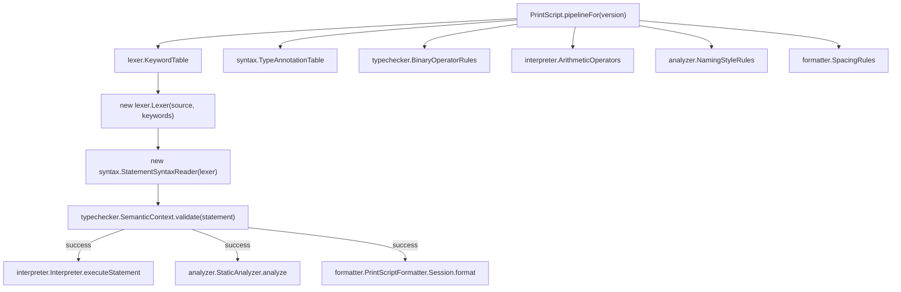

# Application Module

The application module is the use-case boundary for PrintScript.

It exposes stable operations independent from CLI:

- execute source
- format source
- analyze source
- validate source

Responsibilities:

- wire version-specific factories
- pass immutable config objects to tools
- coordinate progress reporting
- collect diagnostics
- orchestrate syntax, semantics, interpreter, formatter, and analyzer
- own `CommandResult`, `LanguageVersion`, and `ProgressReporter` — these are orchestration-only
  concepts, used nowhere in the language core (lexer, syntax, semantics, interpreter, formatter,
  analyzer), so they belong to the module that actually uses them rather than a shared foundation
  module

The application layer should not contain language rules. It should compose the core modules.

This is also the composition root for the pull-based pipeline: it is the one place (besides
[testkit](../testkit/ARCHITECTURE.md), for tests) allowed to construct a concrete `lexer.Lexer` and
wire it into a `syntax.StatementSyntaxReader`. Every core module in between depends only on the
`tokens.TokenSource`/`syntax.StatementSource` ports, never on each other's concrete
implementation — `application` is where those ports get bound to real implementations.

`PrintScript` is also where every version-specific strategy object gets selected: `KeywordTable`,
`TypeAnnotationTable`, `BinaryOperatorRules`, `ArithmeticOperators`, `NamingStyleRules`,
`SpacingRules` are all constructed here (currently all `.v1()`) and injected into `Lexer`,
`SemanticContext`, `Interpreter`, `StaticAnalyzer`, and `PrintScriptFormatter` respectively. None of
those classes decide their own version-specific behavior — they only receive it. Swapping in a new
version's behavior for any of them means changing exactly one line here, not the consuming class.

Versioning should affect construction of the language pipeline.

```text
requested version
  -> versioned factory
  -> lexer/parser/semantic/interpreter/formatter/analyzer implementation
```

Future versions should be additive. A newer version may add syntax, types, built-ins, analyzer rules, or formatter options, but should not change the meaning of valid older-version programs.

## Composition root wiring



Everything on the left of `pipelineFor` is a version-specific strategy selected in exactly one
place; everything it feeds into (`Lexer`, `SemanticContext`, `Interpreter`, `StaticAnalyzer`,
`PrintScriptFormatter`) only ever receives a strategy, never decides one itself.

Representative tests: `src/test/java/org/printscript/application/PrintScriptV11Test.java`
(end-to-end v1.1 behavior across the whole pipeline), `JsonPrintScriptConfigReaderTest.java` (the
JSON config schema), `LanguageVersionTest.java`.
