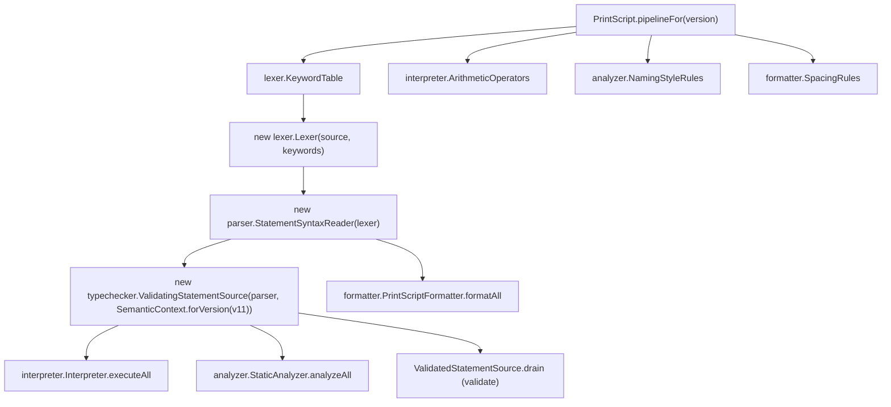

# Application Module

The application module is the use-case boundary for PrintScript.

It exposes stable operations independent from CLI:

- execute source
- format source
- analyze source
- validate source

Responsibilities:

- wire version-specific factories
- pass immutable config objects to tools
- coordinate progress reporting
- collect diagnostics
- orchestrate lexer, parser, typechecker, interpreter, formatter, and analyzer
- own `CommandResult`, `LanguageVersion`, `ProgressReporter`, `InputSource`, and
  `EnvironmentSource` — these are orchestration-only concepts (or, for the latter two, this
  facade's own port vocabulary for interactive I/O), used nowhere in the language core (lexer, ast,
  types, typetable, interpreter, formatter, analyzer), so they belong to the module that actually
  uses them rather than a shared foundation module. `InputSource`/`EnvironmentSource` are adapted
  internally to `interpreter.InputPort`/`EnvironmentPort` when constructing an `Interpreter` — `cli`
  implements this facade's own port types, not `interpreter`'s, so it never needs to depend on
  `interpreter` just to supply real stdin/environment access.

The application layer should not contain language rules. It should compose the core modules.

This is also the composition root for the pull-based pipeline: it is the one place (besides
[testkit](../testkit/ARCHITECTURE.md), for tests) allowed to construct a concrete `lexer.Lexer`,
wire it into a `parser.StatementSyntaxReader`, and wrap that into a
`typechecker.ValidatingStatementSource` for the three commands that need validation (`execute`,
`analyze`, `validate` — `format` uses the bare `StatementSyntaxReader`, since formatting never
validates). It does not drive the statement-by-statement loop itself: each terminal module folds
the stream it's handed into its own result (`Interpreter#executeAll`, `StaticAnalyzer#analyzeAll`,
`PrintScriptFormatter#formatAll`, `ValidatedStatementSource#drain`), reading it through the
`tokens.TokenSource`/`ast.StatementSource`/`typetable.ValidatedStatementSource` ports it already
depends on — never through `application`. This is also why `application` itself has no dependency
on `ast`/`typetable`/`types`: it never touches `StatementSyntax`/`SemanticModel` directly, only the
higher-level stream types those `*All` methods accept.

`PrintScript` is also where every version-specific strategy object *it directly constructs* gets
selected: `KeywordTable`, `ArithmeticOperators`, `NamingStyleRules`, `SpacingRules` (currently all
`.v1()`) are injected into `Lexer`, `Interpreter`, `StaticAnalyzer`, and `PrintScriptFormatter`
respectively. `TypeAnnotationTable`/`BuiltinRegistry` selection lives behind
`typechecker.SemanticContext.forVersion(boolean)` instead, since `application` has no other reason
to depend on `typetable`/`types`. None of the receiving classes decide their own version-specific
behavior — they only receive it. Swapping in a new version's behavior means changing exactly one
line, in `PrintScript` or in `SemanticContext.forVersion`, not the consuming class.

Versioning should affect construction of the language pipeline.

```text
requested version
  -> versioned factory
  -> lexer/parser/semantic/interpreter/formatter/analyzer implementation
```

Future versions should be additive. A newer version may add syntax, types, built-ins, analyzer rules, or formatter options, but should not change the meaning of valid older-version programs.

## Composition root wiring



Everything on the left of `pipelineFor` is a version-specific strategy selected in exactly one
place; everything it feeds into (`Lexer`, `Interpreter`, `StaticAnalyzer`, `PrintScriptFormatter`)
only ever receives a strategy, never decides one itself. `format` is the odd one out on purpose —
it reads straight off `parser.StatementSyntaxReader`, skipping `ValidatingStatementSource`, because
formatting a syntactically valid but semantically invalid program is still meaningful.

Representative tests: `src/test/java/org/printscript/application/PrintScriptV11Test.java`
(end-to-end v1.1 behavior across the whole pipeline), `JsonPrintScriptConfigReaderTest.java` (the
JSON config schema), `LanguageVersionTest.java`.
