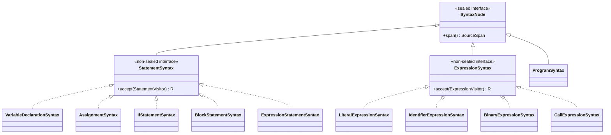

# AST Module

The ast module owns source structure. It builds on [tokens](../tokens/ARCHITECTURE.md) (the
`SyntaxToken` shape every node holds, plus `SyntaxException`) and [types](../types/ARCHITECTURE.md)
(for the one place a tree shape needs a type: `LiteralExpressionSyntax.literalType`).

Responsibilities:

- AST model
- `StatementSource` — the pull-based port a statement producer implements and a statement consumer
  (the composition root in [toolchain](../toolchain/ARCHITECTURE.md)) depends on
- concrete/lossless syntax representation when needed by formatting
- statement and expression dispatch protocols

The type-system vocabulary — `TypeName`, `TypeNameVisitor`, `TypeAnnotationTable` — lives in a
separate [types](../types/ARCHITECTURE.md) module, not here: it describes values in the type
system, not tree structure, and `TypeAnnotationTable` doesn't touch a node at all. This module
consumes `TypeName` (one field, on `LiteralExpressionSyntax`) but never `TypeAnnotationTable`.

The parser itself — `StatementSyntaxReader`/`SyntaxTreeBuilder` — lives in a separate
[parser](../parser/ARCHITECTURE.md) module, not here. This module defines the tree shape and the
port a parser implements; it never builds one. `formatter`, `interpreter`, and `analyzer` all
depend on `ast` (they walk the AST) but none of them depend on `parser` (they never build one —
they receive an already-parsed tree from `toolchain`).

Execution, validation, and analysis consume AST statements through a pull-based parser stream.

```text
SourceInput
  -> TokenSource (Lexer)
  -> TokenStream
  -> Parser (StatementSyntaxReader, implements StatementSource)
  -> Statement
```

Formatting consumes concrete syntax or token trivia.

```text
SourceInput
  -> TokenSource (Lexer)
  -> TokenStream with Trivia
  -> Lossless CST
```

Parser recovery is not part of the current design. All commands should stop at the first syntax error.

If recovery is needed later, semicolon should be the main synchronization point.

AST nodes should be immutable language objects. They own structural invariants and dispatch, but not tool-specific behavior.

The formatter needs access to syntax trivia. Comments and whitespace are trivia, not syntactic sugar.

## AST shape and dispatch



`SyntaxNode` is `sealed` to exactly these three branches; `StatementSyntax`/`ExpressionSyntax` are
each `non-sealed` so new concrete node kinds (a future statement or expression form) can be added
without reopening `SyntaxNode` itself. Every consumer (typetable, interpreter, formatter, analyzer)
dispatches on the concrete node kind through `accept`/`StatementVisitor`/`ExpressionVisitor`, never
`instanceof` — see the "Recurring pattern" section in
[docs/architecture.md](../docs/architecture.md) for why this shape is used repeatedly across the
core.

Representative tests: `src/test/java/org/printscript/ast/nodes/expressions/ExpressionSyntaxSpanTest.java`,
`nodes/statements/StatementSyntaxSpanTest.java`. Type-vocabulary tests
(`TypeAnnotationTableTest.java`, `TypeNameTest.java`) live in [types](../types/ARCHITECTURE.md).
Parser-specific tests (`ParserTest.java`, `ParserV11Test.java`, `ParserDeclarationTest.java`,
`StatementSyntaxReaderTest.java`, `SyntaxTreeBuilderTest.java`) live in
[parser](../parser/ARCHITECTURE.md) alongside the code they test.
