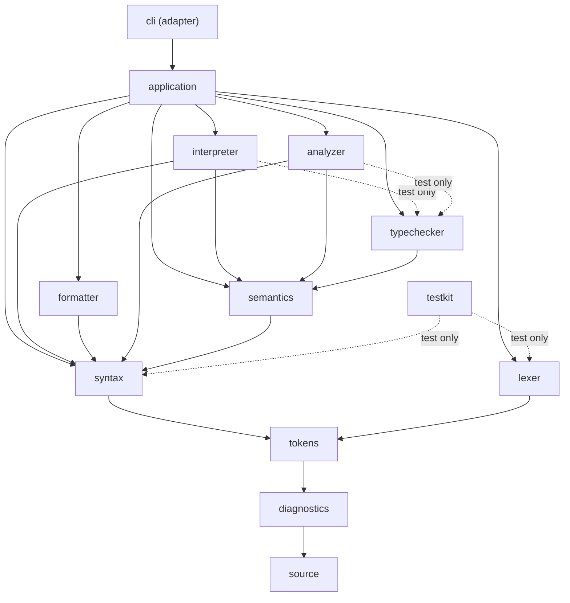
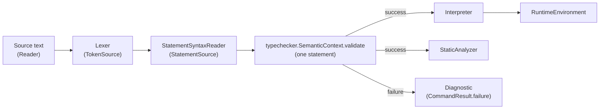
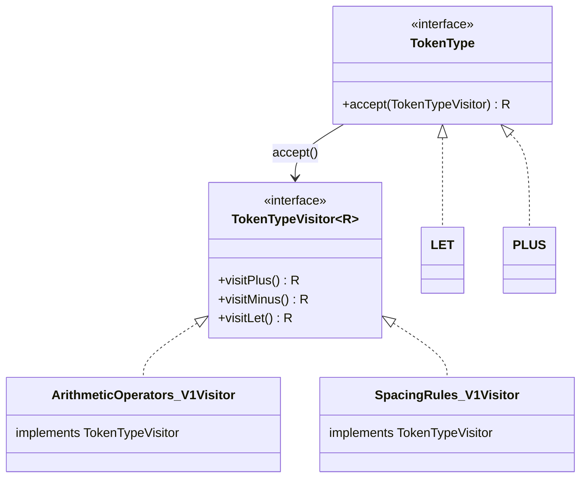

# PrintScript Architecture

This document is the entrypoint for the architecture notes. Start at the [root README](../README.md)
for build/run instructions and a quick module index; come here for the design rules and the module
dependency graph that don't fit a one-line summary.

PrintScript should be built as a small language core surrounded by replaceable interaction adapters. The current adapter is the CLI, but the core must not depend on CLI concepts. Future adapters could be a REST API, editor plugin, web UI, Gradle plugin, or language server.

## Architecture Notes

- [Source Module](../source/ARCHITECTURE.md)
- [Diagnostics Module](../diagnostics/ARCHITECTURE.md)
- [Tokens Module](../tokens/ARCHITECTURE.md)
- [Lexer Module](../lexer/ARCHITECTURE.md)
- [Syntax Module](../syntax/ARCHITECTURE.md)
- [Semantics Module](../semantics/ARCHITECTURE.md)
- [Typechecker Module](../typechecker/ARCHITECTURE.md)
- [Interpreter Module](../interpreter/ARCHITECTURE.md)
- [Formatter Module](../formatter/ARCHITECTURE.md)
- [Analyzer Module](../analyzer/ARCHITECTURE.md)
- [Application Module](../application/ARCHITECTURE.md)
- [CLI Module](../cli/ARCHITECTURE.md)
- [Testkit Module](../testkit/ARCHITECTURE.md)

See also [findings-review.md](findings-review.md) for known, not-yet-fixed inconsistencies between
some of these modules' `build.gradle`/`module-info.java` descriptors.

## Module dependency graph

Each arrow is a real Gradle module dependency (verified against every module's `build.gradle`), not
an aspiration. `cli` is the only module allowed to depend on `application`; every other module below
it is part of the language core and must stay adapter-agnostic.

Notice `lexer` and `syntax` both depend on `tokens` but never on each other — that's deliberate, see
[Tokens Module](../tokens/ARCHITECTURE.md). The same reasoning splits `typechecker` out of
`semantics`: `interpreter`/`analyzer` read a `SemanticModel` but never run the checker that produces
one, so only `application` (composition root) depends on `typechecker` in production — `interpreter`
and `analyzer` only reach it from their own test source sets, to build fixtures.

## Pipeline data flow

What actually happens when `application.PrintScript` runs a command, for the statements that make it
through validation. Formatting instead reads token trivia off the same lexer/parser stages; see
[Syntax Module](../syntax/ARCHITECTURE.md) for that second consumption path.

## Recurring pattern: interface-with-singletons + visitor

Six otherwise-unrelated "closed set of kinds" types across the core follow the same shape, so it's
documented once here instead of six times: `tokens.TokenType`, `lexer.Punctuation`,
`syntax.TypeName`, `interpreter.RuntimeValue`, `analyzer.NamingStyle`, and the AST's
`syntax.nodes.expressions.ExpressionSyntax` / `syntax.nodes.statements.StatementSyntax`. Each is
modeled as an interface with one singleton constant (or sealed subtype) per kind and an
`accept(XVisitor<R>)` method, rather than a Java `enum` with a `switch`.

The payoff: adding a new kind (e.g. a new `TokenType` constant) forces a compile error in every
`XVisitor` implementation across every module that dispatches on it — `interpreter.ArithmeticOperators`,
`formatter.SpacingRules`, and any future one — until every case is handled. A `switch` over an
`enum` only gets that same exhaustiveness check if every call site remembers to write one.

## Main Direction

- Keep the language core independent from interaction layers.
- Process source code statement by statement.
- Use immutable values wherever practical.
- Surface user-code problems as structured diagnostics.
- Keep side effects behind ports.
- Route version-specific behavior through factories.
- Pipeline stages communicate through pull-based port interfaces (`TokenSource`, `StatementSource`)
  owned by the module that defines the value they stream, not through each other's concrete
  implementation classes. A stage's build.gradle/module-info dependency should point at the module
  that owns the contract it consumes, never at the module that happens to produce it today.

## Design Rules

- AST is for language meaning.
- Lossless CST/token trivia is for formatting and comment preservation.
- Parser recovery is not part of the current design; commands stop at the first syntax error.
- Runtime errors stop execution immediately.
- Variables require explicit type annotations.
- Numbers use decimal semantics.
- Config files use JSON, read through the `application.PrintScriptConfigReader` port (`cli` wires
  in the production `JsonPrintScriptConfigReader`); the core config types (`FormatterConfig`,
  `AnalyzerConfig`) are not coupled to any particular file format.
- No single "common" grab-bag module: shared vocabulary is split by cohesion (`source`,
  `diagnostics`, `tokens`) so a module only depends on the specific concept it actually uses.
  Orchestration-only types (`CommandResult`, `LanguageVersion`, `ProgressReporter`) live in
  `application`, the only place that uses them, rather than in a shared foundation module.
