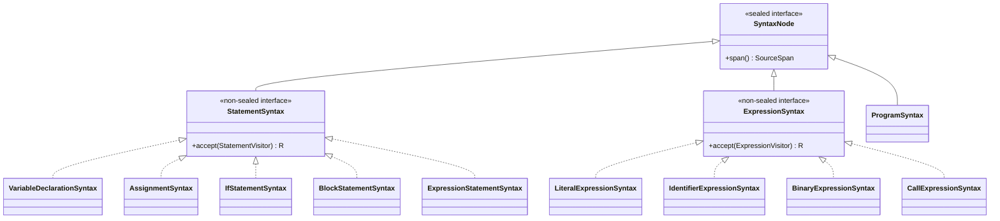

# Syntax Module

The syntax module owns source structure. It builds on the [tokens module](../tokens/ARCHITECTURE.md),
which owns the token model (`Token`, `SyntaxToken`, `TokenType`, `SyntaxException`, `TokenSource`).
It does **not** depend on [lexer](../lexer/ARCHITECTURE.md) — the scanning implementation — at all.

Responsibilities:

- parser
- AST model
- `StatementSource` — the pull-based port a statement producer (`StatementSyntaxReader`)
  implements and a statement consumer (the composition root in
  [application](../application/ARCHITECTURE.md)) depends on
- `TypeAnnotationTable` — resolves a type-annotation lexeme to a `TypeName`; a swappable strategy
  (default `v1()`) consumed by [semantics](../semantics/ARCHITECTURE.md), not by anything in this
  module
- concrete/lossless syntax representation when needed by formatting
- statement and expression dispatch protocols

The syntax module `requires transitive` the tokens module: AST nodes hold `SyntaxToken` values directly,
so anything consuming the syntax module's public API (semantics, formatter, interpreter, analyzer,
application) can reference token types without an explicit dependency of their own.

`StatementSyntaxReader` takes a `tokens.TokenSource` in its constructor rather than constructing a
`Lexer` itself, and `SyntaxTreeBuilder` takes a `StatementSource` rather than a `Reader`/`String`.
Whatever needs to go from raw text to statements — currently only the composition root in
`application`, plus [testkit](../testkit/ARCHITECTURE.md) for tests — is responsible for
constructing a concrete `Lexer` and handing it in. This is what lets `syntax` and `lexer` both
depend on `tokens` without depending on each other.

Execution, validation, and analysis consume AST statements through a pull-based parser stream.

```text
SourceInput
  -> TokenSource (Lexer)
  -> TokenStream
  -> Parser (StatementSyntaxReader, implements StatementSource)
  -> Statement
```

Formatting consumes concrete syntax or token trivia.

```text
SourceInput
  -> TokenSource (Lexer)
  -> TokenStream with Trivia
  -> Lossless CST
```

Parser recovery is not part of the current design. All commands should stop at the first syntax error.

If recovery is needed later, semicolon should be the main synchronization point.

AST nodes should be immutable language objects. They own structural invariants and dispatch, but not tool-specific behavior.

The formatter needs access to syntax trivia. Comments and whitespace are trivia, not syntactic sugar.

## AST shape and dispatch



`SyntaxNode` is `sealed` to exactly these three branches; `StatementSyntax`/`ExpressionSyntax` are
each `non-sealed` so new concrete node kinds (a future statement or expression form) can be added
without reopening `SyntaxNode` itself. Every consumer (semantics, interpreter, formatter, analyzer)
dispatches on the concrete node kind through `accept`/`StatementVisitor`/`ExpressionVisitor`, never
`instanceof` — see the "Recurring pattern" section in
[docs/architecture.md](../docs/architecture.md) for why this shape is used repeatedly across the
core.

Representative tests: `src/test/java/org/printscript/syntax/ParserTest.java` (v1 grammar),
`ParserV11Test.java` (`const`/`if`/`else`/boolean literals added in v1.1),
`ParserDeclarationTest.java` (variable declaration edge cases).
