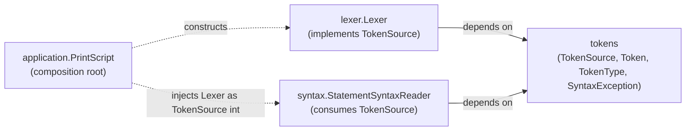

# Tokens Module

Owns the token contract shared by every stage that produces or consumes tokens, without owning
scanning itself.

Responsibilities:

- `Token` — raw lexer output.
- `SyntaxToken` — the immutable, trivia-carrying token shape the parser attaches to AST nodes.
- `TokenType` — the token kind. Modeled as an interface with one singleton constant per kind (not a
  Java `enum`) so every `TokenTypeVisitor` implementation across the codebase must add a case for a
  new kind at compile time; see the "Recurring pattern" section in
  [docs/architecture.md](../docs/architecture.md).
- `TokenSource` — the pull-based port (`Token next()`) a token producer implements and a token
  consumer depends on. This is what lets [lexer](../lexer/ARCHITECTURE.md) and
  [syntax](../syntax/ARCHITECTURE.md) avoid depending on each other directly: `lexer` depends on
  `tokens` to implement `TokenSource`, `syntax` depends on `tokens` to consume it, and neither
  depends on the other.
- `SyntaxException` — the shared syntax-phase error type, since both the lexer's scanning errors
  and the parser's parse errors are surfaced the same way.

Design rules:

- Depends only on [diagnostics](../diagnostics/ARCHITECTURE.md) (`requires transitive`, since
  `SyntaxException` exposes `Diagnostic`, and `Token`/`SyntaxToken` expose `SourceSpan`
  transitively through it).
- Never depend on `lexer` or `syntax`. This module exists specifically so those two do not need to
  depend on each other.

## Why lexer and syntax don't depend on each other

`lexer` and `syntax` each depend only on this module, never on each other. The composition root in
[application](../application/ARCHITECTURE.md) is the only place that knows both concrete types
exist and wires one into the other; every module in between types against `TokenSource`.

Representative tests: `src/test/java/org/printscript/tokens/SyntaxTokenTest.java`,
`SyntaxExceptionTest.java`.
