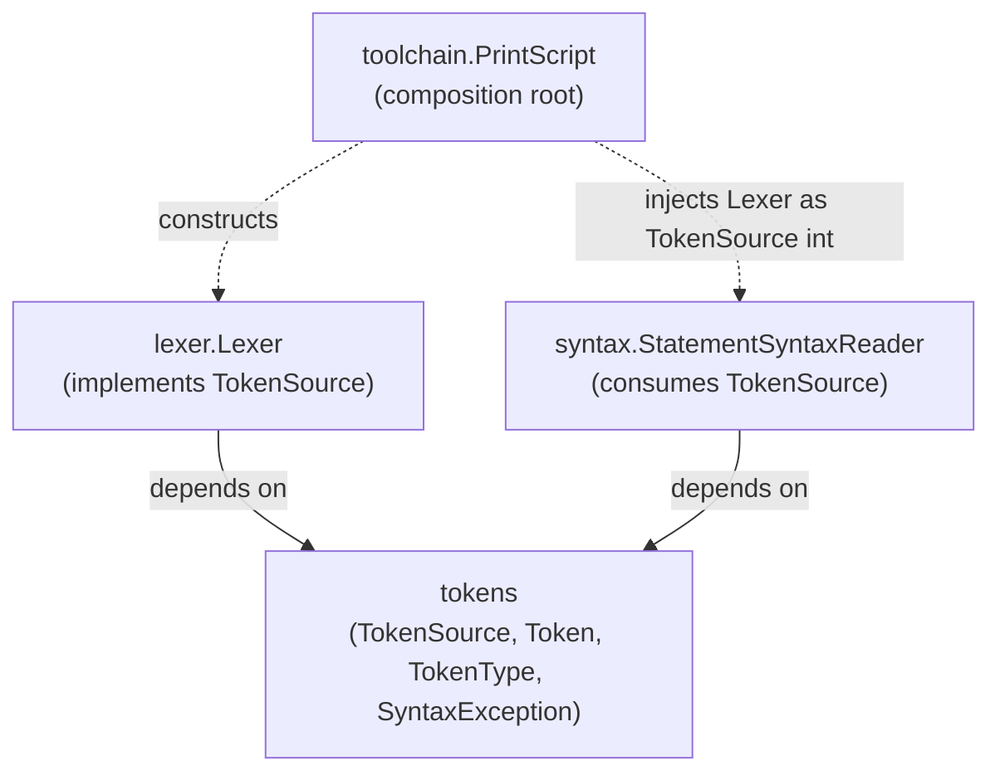

# Tokens Module

Owns the raw token-streaming contract shared by every stage that produces or consumes tokens, plus
the closed set of token kinds those tokens carry.

Responsibilities:

- `Token` — raw lexer output.
- `TokenType`, `TokenTypeVisitor` — the closed set of token kinds, dispatched via visitor rather
  than a Java `enum`/`switch` (see the "Recurring pattern" section in
  [docs/architecture.md](../docs/architecture.md)).
- `TokenSource` — the pull-based port (`Token next()`) a token producer implements and a token
  consumer depends on. This is what lets [lexer](../lexer/ARCHITECTURE.md) and
  [parser](../parser/ARCHITECTURE.md) avoid depending on each other directly: `lexer` depends on
  `tokens` to implement `TokenSource`, `parser` depends on `tokens` to consume it, and neither
  depends on the other.
- `SyntaxException` — the shared syntax-phase error type, since both the lexer's scanning errors
  and the parser's parse errors are surfaced the same way.
- `SyntaxToken` — the immutable, trivia-carrying token shape the AST retains, built from a `Token`
  via `SyntaxToken.from(Token)`.

Design rules:

- Depends on [diagnostics](../diagnostics/ARCHITECTURE.md) (`requires transitive`, since
  `SyntaxException` exposes `Diagnostic`, and `Token` exposes `SourceSpan` transitively through it).
- Never depend on `lexer` or `parser`. This module exists specifically so those two do not need to
  depend on each other.

## Why lexer and parser don't depend on each other

`lexer` and `parser` each depend only on this module, never on each other. The composition root in
[toolchain](../toolchain/ARCHITECTURE.md) is the only place that knows both concrete types
exist and wires one into the other; every module in between types against `TokenSource`.

Representative tests: `src/test/java/org/printscript/tokens/SyntaxExceptionTest.java`,
`TokenTypeTest.java`, `SyntaxTokenTest.java`.
